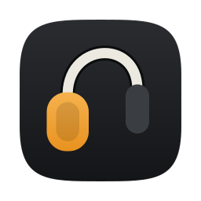
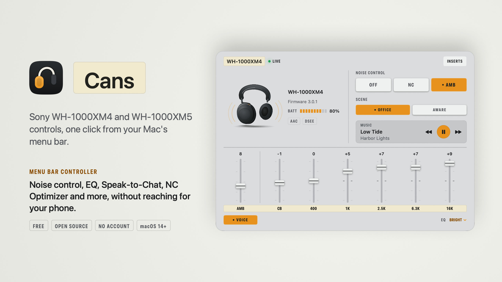
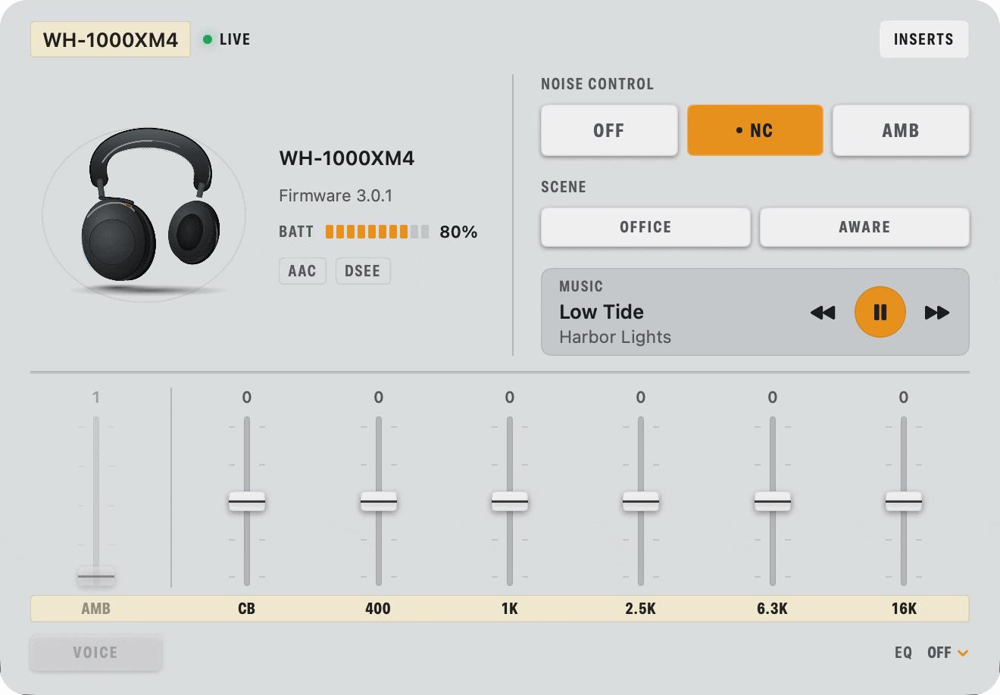
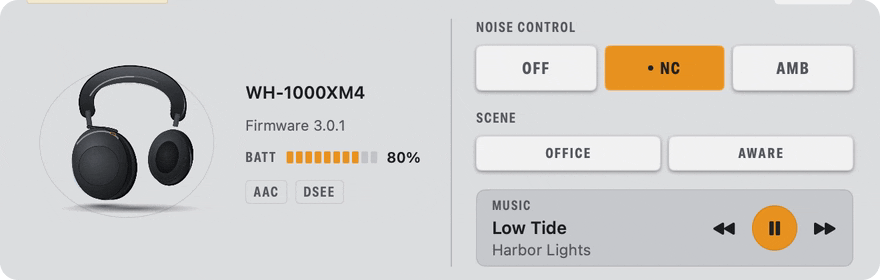
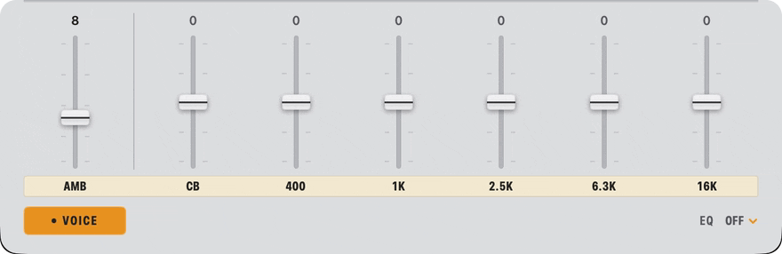
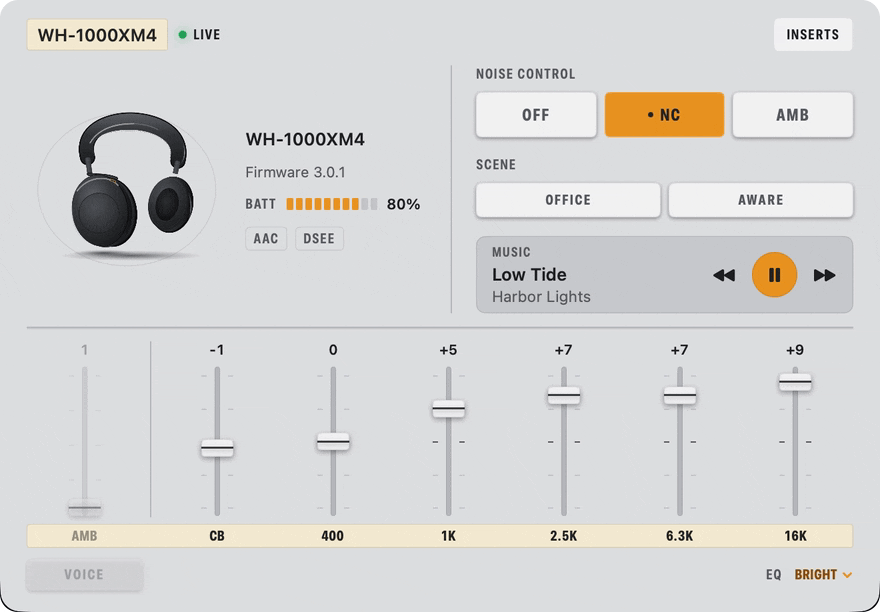
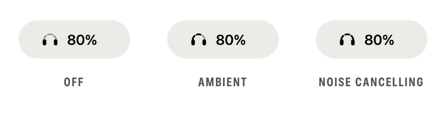
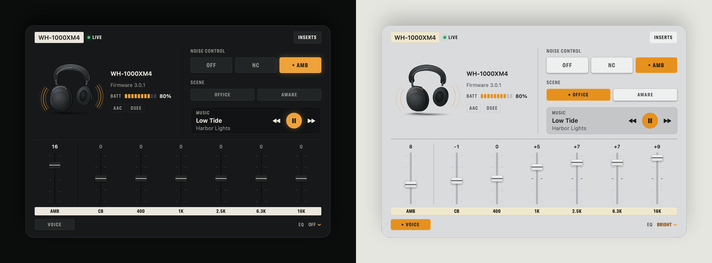

<p align="center">
  
</p>

<h1 align="center">Cans</h1>

<p align="center">
  <b>Your Sony WH-1000XM4 and WH-1000XM5, one click from the Mac menu bar.</b><br>
  Noise cancelling, EQ, Speak-to-Chat and more, without reaching for your phone.
</p>

<p align="center">
  <a href="../../releases/latest"></a>
</p>

<p align="center">
  <sub>Free and open source · macOS 14+ · 1.3 MB download · no account, no network access</sub>
</p>

<p align="center">
  <picture>
    <source media="(prefers-color-scheme: dark)" srcset="docs/media/hero-dark.jpg">
    
  </picture>
</p>

<p align="center">
  <picture>
    <source media="(prefers-color-scheme: dark)" srcset="docs/media/demo-dark.gif">
    
  </picture>
  <br>
  <sub>Recorded live on a WH-1000XM4. Every change is read back from the headphones.</sub>
</p>

## What it does

<table>
  <tr>
    <td width="50%" valign="top">
      <b>Noise control in one click</b><br>
      <sub>Noise cancelling, Ambient or Off, a 20-step ambient fader, Focus on Voice, and Office / Aware scenes. ⌥⌘A switches from anywhere.</sub><br><br>
      <picture>
        <source media="(prefers-color-scheme: dark)" srcset="docs/media/feat-noise-dark.gif">
        
      </picture>
    </td>
    <td width="50%" valign="top">
      <b>EQ on real faders</b><br>
      <sub>Sony's presets, Clear Bass and a five-band curve. Save your own curves on the Mac.</sub><br><br>
      <picture>
        <source media="(prefers-color-scheme: dark)" srcset="docs/media/feat-eq-dark.gif">
        
      </picture>
    </td>
  </tr>
  <tr>
    <td width="50%" valign="top">
      <b>Every setting, one level down</b><br>
      <sub>Speak-to-Chat, NC Optimizer with air pressure, DSEE Extreme, multipoint, touch controls, auto power off and more.</sub><br><br>
      <picture>
        <source media="(prefers-color-scheme: dark)" srcset="docs/media/feat-inserts-dark.gif">
        
      </picture>
    </td>
    <td width="50%" valign="top">
      <b>Your mode, in the menu bar</b><br>
      <sub>The icon's band lights up to show Off, Ambient or Noise cancelling, next to your battery level.</sub><br><br>
      <picture>
        <source media="(prefers-color-scheme: dark)" srcset="docs/media/menubar-dark.png">
        
      </picture>
    </td>
  </tr>
</table>

Cans also shows **what's playing in any app** (Spotify, Music, browsers…) with play/pause/skip, plus battery, codec and DSEE status.

### Light and dark

It follows your Mac's appearance.



## Install

**With Homebrew**

```sh
brew install --cask unhingedpanda/tap/cans
```

**Or by hand:** download `Cans.zip` from the [latest release](../../releases/latest), unzip it, and move **Cans.app** to **/Applications**. You can verify the download with `shasum -a 256 -c Cans.zip.sha256`.

**First launch.** Cans isn't notarized yet (that needs a paid Apple developer account), so macOS blocks it the first time you open it:

- **macOS 15 and later:** open Cans once, then go to **System Settings → Privacy & Security**, click **Open Anyway** next to Cans, and confirm.
- **macOS 14:** right-click **Cans.app** → **Open**.

Then allow Bluetooth access when asked.

## Good to know

- **One app at a time.** Only one device can hold Sony's control channel. If Cans says **Busy**, close Sound Connect on your phone; Cans retries on its own.
- **Keyboard.** ⌥⌘A toggles NC and Ambient from anywhere. While the panel is open, keys 1/2/3 pick Off/NC/Ambient.
- **Light footprint.** About 8–18 MB of memory, 0% CPU when idle, and about 0.2% while the animated panel is open.
- **Out of scope.** Phone-only Sound Connect features: adaptive sound control, 360 Reality Audio setup, and the activity log. Volume stays with your Mac's volume keys, because the headphones ignore volume changes while nothing is playing.
- **Easter eggs.** The headphone illustration reacts to your listening mode, and it hides a couple of surprises.

<details>
<summary><b>Full compatibility</b></summary>

| | WH-1000XM4 | WH-1000XM5 |
|---|---|---|
| Noise cancelling / Ambient / Off, ambient level, Focus on Voice | ✓ | ✓ |
| Battery, EQ presets, Clear Bass + 5-band custom EQ, saved Mac presets | ✓ | ✓ |
| Codec and DSEE status | ✓ | – |
| Now playing from any app, play/pause/skip | ✓ | ✓ |
| Speak-to-Chat (on/off, sensitivity, timeout, voice focus) | ✓ | – |
| NC Optimizer with air-pressure readout | ✓ | – |
| DSEE Extreme, sound quality vs. stable connection | ✓ | – |
| Touch panel, custom button, pause when taken off, auto power off | ✓ | – |
| Multipoint, voice guidance, power off | ✓ | – |

Every XM4 command was verified on a real WH-1000XM4 (firmware 3.0.1). XM5 support covers what the original XM5 Control app implemented; XM5 bug reports are very welcome.

</details>

## Developers

Building, the protocol, how Now Playing works, and the end-to-end tests that run against real headphones are all in [docs/DEVELOPMENT.md](docs/DEVELOPMENT.md).

## Credits

Cans started as a fork of [XM5 Control](https://github.com/Maadlou/xm5-control-macos) by Maadlou (MIT). The protocol work draws on [Gadgetbridge](https://codeberg.org/Freeyourgadget/Gadgetbridge) and [mos9527/SonyHeadphonesClient](https://github.com/mos9527/SonyHeadphonesClient). The headphone illustration is original artwork made for Cans; see [CREDITS.md](CREDITS.md).

Cans is not affiliated with or endorsed by Sony. Sony, WH-1000XM4 and WH-1000XM5 are trademarks of Sony Group Corporation, used here only to identify compatible products.

## Support

Cans is free and open source. If it saves you reaching for your phone, you can [buy me a coffee](https://buymeacoffee.com/yash.raj).

<a href="https://buymeacoffee.com/yash.raj"></a>

## License

MIT. See [LICENSE](LICENSE); the original copyright notice is kept.
